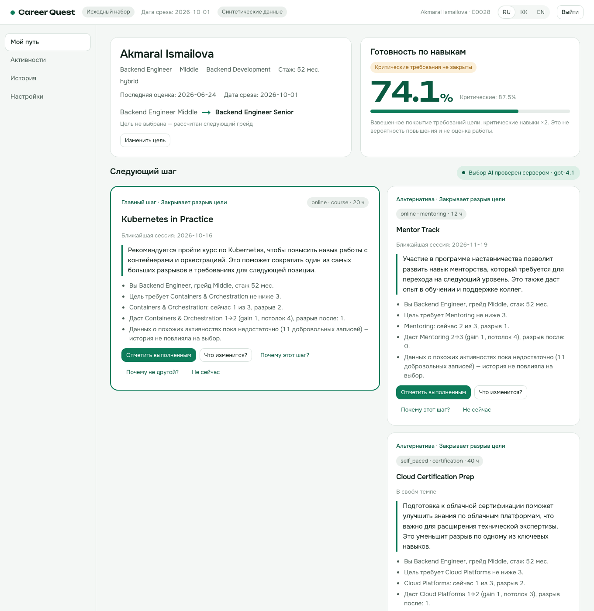
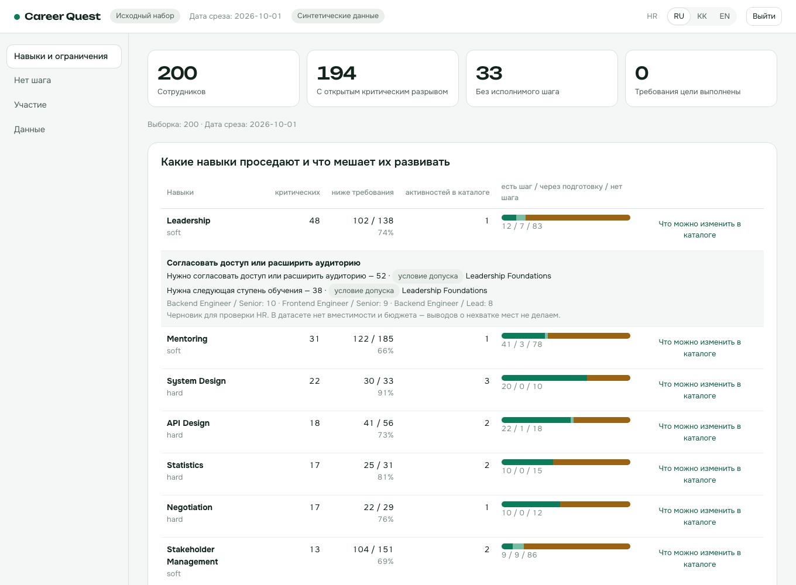

# Career Quest - объяснимый навигатор развития сотрудника

**Развёрнутая версия:** https://career-quest-bay.vercel.app

HackAlem AI, трек Halyk Bank, кейс «Career Quest».



## 1. Краткое описание

**Проблема.** Сотрудник получает поток разрозненных HR-событий и не видит, зачем ему конкретная активность и куда она ведёт. Поэтому обучение проходится формально, а на добровольные активности приходят немногие. HR не видит, какие компетенции проседают и почему у части людей нет понятного следующего шага.

**Для кого.**
- Сотрудник со стажем 1–5 лет - видит свою траекторию и получает объяснимый следующий шаг.
- HR - видит дефициты навыков, ограничения каталога обучения и тех, у кого нет шага.

**Что делает решение.** По профилю, истории участия и требованиям следующего грейда подбирает 1–3 активности. Для каждой показывает обоснование: минимум три фактора, каждый ссылается на конкретные данные. После выполнения активности пересчитывает навыки, готовность и маршрут. Для HR строит срез по проседающим навыкам с причинами.

## 2. Что реализовано

**Сотрудник («Мой путь»)**
- Профиль: роль, грейд, подразделение, стаж, дата последней оценки.
- Цель и готовность по навыкам. Цель берётся из профиля, выбирается вручную или рассчитывается как следующий грейд - источник цели подписан.
- **Следующий шаг:** главный шаг и до двух альтернатив. У каждой:
  - текст объяснения от AI;
  - список проверяемых фактов;
  - «Почему этот шаг?» - все факты и разбор оценки кандидата;
  - «Почему не другой?» - самый низкий навык, другие кандидаты и заблокированные активности с причинами.
- **«Что изменится?»** - прогноз навыков и готовности без изменения данных (what-if).
- **«Спроси о развитии»** - чат на экране сотрудника: прогноз после одной доступной активности и объяснения 14 терминов платформы. Числа берутся из того же what-if, определения - из фиксированного глоссария. История чата хранится только в памяти вкладки.
- **«Отметить выполненным»** - навыки, готовность и маршрут пересчитываются, показывается изменение в процентных пунктах.
- **«Не сейчас»** - отложить шаг без штрафа.
- **Маршрут до цели** - последовательность до 4 активностей с учётом prerequisites, потолков навыков и дат сессий.
- **Career Graph** - интерактивный SVG-граф «цель → навык → активность» с подписанными связями `requires`, `develops`, `prerequisite`. Клик или Tab + Enter/пробел открывает уровни, эффекты и причины блокировки. Есть переключение между маршрутом и связанным каталогом; текущие навыки отделены от прогноза. На мобильном по умолчанию показаны маршрут и таблица условий. Поддерживаются RU/KK/EN.
- **Навыки** - шкала 0–5 для каждого навыка: оценка, рассчитано по истории, требуется. По кнопке ⓘ видна формула для каждой записи истории.
- Вкладки «Активности» (каталог с причинами недоступности), «История» (участие и состояние истории развития), «Настройки»: учёт истории, добровольные XP и бейджи, сброс отметок.
- Языки RU / KK / EN.

**HR**
- Карточки: сотрудники, открытые критические разрывы, «без исполнимого шага», «требования цели выполнены».
- **«Навыки и ограничения»:** для каждого навыка - сколько людей ниже требования и с критическим разрывом, сколько активностей в каталоге, у скольких есть шаг / путь через подготовку / нет шага. Там же причины (bottleneck detector) и черновик «Что можно изменить в каталоге».
- **«Нет шага»:** кто без рекомендованного шага и почему, с уровнем доказательности причины.
- **«Участие»:** завершаемость, явка и отзывы по активностям. Добровольные и обязательные активности показаны раздельно.
- **«Данные»:** загрузка проверочных профилей жюри (`employees.json` + `activity_history.csv`) → отчёт валидации → изолированный проверочный сценарий.



## 3. Как работает решение

Сценарий от входных данных до результата:

1. **Навыки на дату среза.** Берётся последняя оценка (`employees.json`), затем применяются завершённые активности из истории после `last_review_date`. Правило датасета:
   `actual_gain = max(0, min(gain, max_level − current, 5 − current))`. Навык никогда не понижается, незавершённая активность прироста не даёт.
2. **Цель.** Выбор сотрудника → `career_goal` из профиля → следующий грейд той же роли (предварительный сценарий) → для Lead без цели - соответствие текущей роли.
3. **Разрывы и готовность.** `gap = max(0, required − current)`, критические навыки весят ×2.
   `readiness = Σ w·min(x, r) / Σ w·r`. Это покрытие требований, а не вероятность повышения.
4. **Допуск.** Активность можно рекомендовать, если выполнены все условия:
   - она не обязательная;
   - подходит текущей роли и грейду;
   - выполнены prerequisites;
   - ещё не пройдена (кроме повторяемого клуба `EV_036`);
   - есть будущая сессия или она в своём темпе (self-paced);
   - сотрудник её не отложил.

   Начатая активность предлагается как «продолжить».
5. **Маршрут.** Ограниченный beam search: глубина 4, ширина 40, горизонт 120 дней. Состояние поиска хранит весь вектор навыков, поэтому AND-prerequisites и потолки учитываются корректно.
6. **Ранжирование.** Сначала приоритетные группы:
   - 0 - сокращает критический разрыв или открывает к нему путь;
   - 1 - сокращает другой разрыв;
   - 2 - подготовительный шаг.

   Внутри группы - оценка кандидата:
   `60·G + 25·C + 20·U + 10·(2·affinity − 1) + 3·feedback + бонус формата + бонус продолжения − нагрузка − ожидание`.
   `affinity` - соответствие истории участия: похожий формат (0.5), тип (0.2) и навыки (0.3), с затуханием по давности. При недостатке данных значение нейтральное - 0.5, и объяснение прямо это сообщает.
7. **Факты-обоснования.** Для каждого кандидата сервер собирает факты: профиль и грейд, требование цели, разрыв, эффект активности, история участия, допуск и сессия, оставшиеся критические разрывы.
8. **AI-слой (OpenAI, gpt-6-luna)** получает минимизированный контекст: без имени и ID, до 8 допустимых кандидатов с фактами. Модель выбирает 1–3 шага **только из этого списка**, подбирает подтверждающие факты и пишет 2–3 предложения объяснения на языке пользователя. Затем **сервер проверяет ответ**:
   - ID активностей только из списка кандидатов;
   - главный шаг - из минимальной приоритетной группы;
   - факты покрывают ≥ 3 категорий, включая историю;
   - каждое число в тексте присутствует в выбранных фактах, иначе текст отбрасывается.

   При ошибке или таймауте (9 с) интерфейс честно пишет «Рекомендация рассчитана по правилам; AI сейчас недоступен».
9. **Нет шага - тоже ответ.** Возвращается 0 рекомендаций с точной причиной: `TARGET_REQUIREMENTS_MET`, `NO_RELEVANT_CATALOG_EVENT`, `SKILL_CAP_CEILING`, `AUDIENCE_MISMATCH`, `PREREQUISITES_UNMET`, `ONLY_ALREADY_COMPLETED_EVENTS` и т. д.

**Почему правило «бери минимальный навык» здесь не срабатывает.** Тест `tests/test_core.py::test_multi_factor_recommendation_beats_lowest_skill_rule`: самый низкий навык - Public Speaking, по нему три неявки, а для Senior критичен System Design. Выбирается System Design (группа 0), в объяснении есть факт истории.

## 4. Технологии

| Слой | Что используется |
|---|---|
| Расчётное ядро и API | Python 3.12, FastAPI, Pydantic 2, httpx |
| Фронтенд | Next.js 15 (App Router), React 19, TypeScript (strict), CSS без UI-фреймворков, шрифты Onest и Unbounded (Google Fonts) |
| AI | OpenAI Chat Completions API, модель `gpt-6-luna` (`reasoning_effort=none`), structured output (JSON Schema, strict) |
| Тесты и качество | pytest, ruff; сквозной сценарий в браузере проверялся Playwright |
| Инструменты | uv (Python), npm (Node) |
| Развёртывание | Vercel (Next.js + FastAPI как Python Serverless Function), Docker Compose для локального запуска |

**Как выбрана модель.** Замер 23.09.2026. Вызовы шли прямо в OpenAI API через тот же код `select_actions` и тот же серверный валидатор, что в приложении. Выборка: 32 сотрудника, все 8 ролей, 48 сценариев с языками ru / kk / en. Сравнено 16 конфигураций моделей, всего 768 вызовов. Затем выбранный вариант прошёл отдельную подтверждающую серию из 48 вызовов с промптом v3.

| Модель | Ответы прошли валидатор | Задержка p50 / p95 | Объяснения без найденных ошибок |
|---|---|---|---|
| **gpt-6-luna**, `reasoning_effort=none`, промпт v3 (выбрана) | 48/48 | 4.3 / 5.3 с | 120/120 по автопроверке; при ручном чтении 41 объяснения - 1 ошибка (отказ назван пропуском) |
| gpt-4.1, промпт v1 (была до переключения) | 46/48 (2 таймаута) | 2.8 / 6.1 с | 101/114 |
| gpt-5, gpt-5-mini с `reasoning_effort=low`; gpt-5.5 | - | не укладываются в 9 с | - |

Ограничения замера:
- Промпт v3 настраивался на части этой же выборки, поэтому подтверждающая серия - не независимая проверка.
- Это сравнение на нашем контракте, а не общий рейтинг моделей.

Отдельные замеры:
- **Production**, после переключения: 5 из 5 сотрудников получили проверенный ответ AI за 2.2–5.9 с.
- **8 профилей-ловушек** из `samples/jury/`: 8/8 ответов прошли проверку, максимум 5.6 с.

Модель задаётся переменной `OPENAI_MODEL`. Reasoning-модели поддерживаются (`OPENAI_REASONING_EFFORT`, для gpt-6 по умолчанию `none`). Весь вызов ограничен общим дедлайном 8.8 с; отказ модели, обрезанный или некорректный ответ переводят интерфейс в режим «по правилам».

## 5. Архитектура

```text
data/dataset/*.json|csv ─────┐
проверочный сценарий (HR) ───┤
состояние браузера ──────────┘
(отметки, цели, настройки)
            │ каждый запрос несёт состояние
            ▼
api/index.py (FastAPI, /api/py/*) ── проверка Bearer-токена: сотрудник видит только себя
            │
            ▼
career_quest/            расчётное ядро и сервисы, без HTTP и БД
  auth.py                SessionStore: вход, проверка подписанной сессии, выход
  dataset.py             загрузка датасета, валидация профилей жюри
  progression.py         правило gain/max_level, пересчёт навыков по истории
  goals.py               цель, разрывы, готовность
  history.py             соответствие истории, состояние истории развития
  engine.py              допуск, маршрут (beam search), ранжирование, факты, what-if
  hr.py                  дефициты навыков, bottleneck detector, участие
  ai.py                  общий OpenAI-compatible адаптер + проверка рекомендаций
  chat.py                маршрутизация вопроса, глоссарий, шаблон ответа из simulate
            │
            ▼
Next.js (app/, components/, lib/) ── экраны сотрудника и HR
```

**Хранение.** Исходные данные поставляются вместе с приложением, поэтому новый посетитель сразу видит всех 200 сотрудников. Действия пользователя хранятся в `localStorage` браузера и переживают перезагрузку страницы:
- отметки «выполнено»;
- выбранная цель;
- отложенные шаги;
- настройки;
- загруженный проверочный сценарий.

Сервер не сохраняет данные развития: каждый запрос передаёт это состояние, и сервер пересчитывает всё тем же ядром. Поэтому одна отметка не может начислиться дважды.

**Единое ядро.** Рекомендации, what-if, выполнение и HR-экран вызывают одни и те же функции. Фронтенд формул не считает.

### Чат «Спроси о развитии»

`POST /api/py/employees/{id}/chat` принимает `{message, history, overlay, locale}` с той же Bearer-сессией. `history` - до 8 сообщений `{role: "user" | "assistant", content}`, каждое сообщение и новый вопрос - до 2000 символов. Сотрудник имеет доступ только к себе, HR - к разрешённым профилям. Запросы чата не кешируются и не сохраняются на сервере.

Модель получает только вопрос, короткую историю диалога, текущие разрывы и до 20 доступных активностей (ID + название) из того же персонального каталога, что виден в интерфейсе. Точно упомянутые названия включаются первыми; учитываются и начатые активности. Имя, профиль целиком и исходная история участия не отправляются. Модель не получает инструментов и возвращает JSON с `intent`, `event_id`, `term_id`, `reply_text`; сервер проверяет ID и никогда не показывает свободный текст модели:

- `simulate` → сервер вызывает `engine.simulate()` и возвращает его результат плюс текстовый шаблон с реальными цифрами;
- `explain` → сервер возвращает определение выбранного термина из глоссария;
- `refuse` → фиксированный ответ о границах возможностей.

Фраза «пройти B вместо A» означает прогноз завершения B из текущего состояния, без отмены A или вычитания навыков. Неоднозначные запросы, несколько шагов, назначения и вопросы вне платформы не исполняются. Карточка прогноза переиспользует компонент модального окна «Что изменится?». После изменения профиля старый прогноз скрывается с предложением повторить запрос.

Чат использует те же `OPENAI_API_KEY`, `OPENAI_MODEL`, `OPENAI_BASE_URL` и `OPENAI_REASONING_EFFORT`, что рекомендации, с отдельным `prompt_version=cq-chat-v1`. В этой версии общий адаптер работает через OpenAI-compatible `/chat/completions`; отдельного переключателя или автоматического fallback на Ollama нет. Весь запрос чата имеет дедлайн 8.8 с; при отсутствии ключа, таймауте или некорректном ответе отображается «AI сейчас недоступен, попробуйте позже» и остаётся доступна обычная кнопка what-if.

Для ручной проверки войдите как `E0028`, откройте чат и отправьте «а что если я пройду System Design Fundamentals?», затем «что такое readiness?» и «посчитай зарплату». Для первого запроса сравните цифры с `/simulate` для `EV_005`; второй должен вернуть определение, третий - отказ. Без настроенного ключа проверяется честный fallback. При запуске API без Docker переменные должны быть в окружении процесса; например, после создания `.env`: `uv run uvicorn api.index:app --reload --port 8000 --env-file .env`.

### Сессии и демо-аккаунты

Сотрудник входит по `employee_id` из текущего датасета (включая загруженный проверочный сценарий), пароль по умолчанию - `demo`. HR входит с логином `hr` и паролем `hr-demo`. Пароли задаются на сервере через `DEMO_EMPLOYEE_PASSWORD` и `DEMO_HR_PASSWORD`; общие пароли предназначены только для демо.

`POST /api/py/auth/login` проверяет пароль и выдаёт токен на 8 часов. Браузер сохраняет сессию и отправляет `Authorization: Bearer <token>`; сервер проверяет подпись HMAC-SHA256, срок действия и права. Роль и ID сотрудника берутся из подписанного токена; `x-role` / `x-actor` не дают доступа. `/api/py/meta` и `/api/py/health` остаются публичными: список синтетических сотрудников нужен для выбора на экране входа. Для production необходимо задать собственный `AUTH_SECRET`; встроенный постоянный секрет предназначен для локального запуска.

API работает только через интерфейс `SessionStore` (`create`, `resolve`, `revoke`). Реализация `SignedTokenStore` проверяет токен без словаря активных сессий в памяти, поэтому сессия работает между stateless-инстансами Vercel с одинаковым секретом. Выход удаляет сессию из браузера и добавляет ID токена в локальный список отозванных токенов сервера; отзыв - best-effort: другой инстанс или перезапуск может не знать о нём до истечения 8 часов. Будущий `PostgresSessionStore` с таблицами `auth_users` / `auth_sessions` (например, через SQLAlchemy) заменит один класс без изменений маршрутов, схем ответов или фронтенда.

Состояние в браузере и stateless-токены позволяют жюри запустить приложение без подготовки БД, а команде - развернуть его на serverless Vercel без управляемой БД. Синтетические данные хакатона при этом не передаются во внешнюю базу данных.

## 6. Установка и запуск

**Вариант A - одной командой через Docker**

```bash
git clone https://github.com/BAITC-Hacks/hack-dd7f161b-core-2-duo.git
cd hack-dd7f161b-core-2-duo
cp .env.example .env              # впишите OPENAI_API_KEY (без ключа AI честно переключится на правила)
docker compose up --build
```

Откройте http://localhost:3000 (API - http://localhost:8000/api/py/docs).

Проверено 23.09.2026 на чистой сборке `docker compose up --build`:
- `/health`, `/`, `/me`, `/hr` отвечают 200;
- вход `E0028` / `demo` и `hr` / `hr-demo` работает;
- профиль и HR-дашборд открываются по токену, подделанный заголовок `x-role: hr` получает 401;
- загрузка `samples/jury/` проходит: 8 сотрудников, 19 записей истории.

Без `OPENAI_API_KEY` AI-блок показывает «рассчитано по правилам». Для чего-то большего, чем локальное демо, задайте в `.env` случайный `AUTH_SECRET`.

**Вариант B - без Docker** (нужны Python 3.12 + [uv](https://docs.astral.sh/uv/) и Node.js 22):

```bash
uv sync
npm install
cp .env.example .env
npm run dev                       # FastAPI :8000 + Next.js :3000
```

**Переменные окружения** (`.env.example`):

| Переменная | Назначение |
|---|---|
| `OPENAI_API_KEY` | Ключ OpenAI. Используется только на сервере, в браузер не передаётся. |
| `OPENAI_MODEL` | По умолчанию `gpt-6-luna` |
| `OPENAI_REASONING_EFFORT` | Опционально; для gpt-6 по умолчанию `none` |
| `OPENAI_BASE_URL` | Опционально: любой OpenAI-совместимый endpoint |
| `AUTH_SECRET` | Секрет подписи сессий. Для production задайте случайный секрет, одинаковый на всех инстансах. Без настройки используется постоянный dev-секрет. |
| `DEMO_EMPLOYEE_PASSWORD` | Общий демо-пароль сотрудников, по умолчанию `demo` |
| `DEMO_HR_PASSWORD` | Демо-пароль HR, по умолчанию `hr-demo` |

**Развёртывание на Vercel:** `npx vercel deploy --prod` из корня репозитория. Переменные `OPENAI_API_KEY` и `AUTH_SECRET` задаются в настройках проекта Vercel.

## 7. Как проверить решение

**Тесты:**

```bash
npm run check    # ruff format/lint + pytest + сборка фронтенда с проверкой типов
npx playwright install chromium   # один раз
npm run e2e      # 11 браузерных E2E-тестов: сами поднимают API и фронтенд
E2E_BASE_URL=https://career-quest-bay.vercel.app npm run e2e   # те же тесты против развёрнутой версии
```

**Оценка качества рекомендаций** (детерминированно, без LLM, ~3 с): `uv run python scripts/evaluate.py` → [`docs/EVALUATION.md`](docs/EVALUATION.md) и `artifacts/evaluation.json`. Скрипт независимо от движка перепроверяет на всех 200 сотрудниках:
- допуск каждой рекомендации и соблюдение `gain` / `max_level`;
- совпадение what-if с результатом выполнения;
- покрытие фактами (≥ 3 категорий);
- причины отсутствия шага.

Также он сравнивает движок с наивным правилом «самый низкий навык» на 6 фикстурах-ловушках.

E2E проверяют:
- основной сценарий: рекомендации, факты, what-if и совпадение прогноза с результатом выполнения;
- сохранение состояния после перезагрузки страницы;
- смену цели;
- HR-экраны;
- загрузку проверочных профилей;
- запрет доступа к чужому профилю;
- вёрстку на ширине 360 px;
- переключение RU / KK / EN.

**Сценарий для жюри** (на https://career-quest-bay.vercel.app или локально):

1. На экране входа найдите `E0028`, нажмите на сотрудника и «Войти». Поле пароля предзаполнено демо-паролем `demo` (при изменении серверной настройки введите заданный пароль).
2. «Мой путь». Статус над карточками - «Выбор AI проверен сервером · gpt-6-luna». У главного шага есть текст AI и факты.
3. «Почему этот шаг?» - все факты и разбор оценки. «Почему не другой?» - почему не самый низкий навык.
4. «Что изменится?» - прогноз готовности (для E0028 74.1% → 75.9%).
5. «Отметить выполненным» - готовность меняется на ту же величину, рекомендации и маршрут пересчитываются. Перезагрузите страницу: состояние сохраняется.
6. «Выйти» → «Войти как HR» → «Войти» с демо-паролем `hr-demo`:
   - «Навыки и ограничения» → «Что можно изменить в каталоге» у Leadership;
   - «Нет шага» → «Открыть профиль»;
   - «Участие» - переключатель «добровольное / обязательное».
7. «Данные» - загрузите `employees.json` и `activity_history.csv` в формате датасета (готовый пример - [`samples/jury/`](samples/jury/): 8 синтетических профилей-ловушек, например «самый низкий навык с тремя пропусками против критического навыка», «потолок уже достигнут», «prerequisite блокирует прямой курс», «курс начат на 75%») → «Проверить» → «Создать сценарий». Шапка переключится на «Проверочный сценарий», а HR-экран и профили будут считаться только по загруженным людям.
8. Разграничение прав:

   ```bash
   curl -s -X POST http://localhost:8000/api/py/hr/dashboard \
     -H 'content-type: application/json' -H 'x-role: hr' -d '{}' -o /dev/null -w '%{http_code}\n'
   # 401 - поддельный заголовок роли не заменяет подписанную сессию

   curl -s -X POST http://localhost:8000/api/py/auth/login \
     -H 'content-type: application/json' -d '{"login":"E0028","password":"demo"}'
   # Ответ: token, role, employee_id, expires_at (Unix timestamp).
   # Передавайте token в Authorization: Bearer <token> для защищённых маршрутов.
   ```

   Тесты `tests/test_auth.py` также проверяют запрет чужого профиля и HR-маршрутов для сотрудника (403), подменённые и просроченные токены, неверный пароль, вход по проверочному сценарию и отзыв при выходе.

## 8. Данные и интеграции

- **Датасет организатора** (`data/dataset/`, синтетические данные, дата среза 2026-10-01):
  - `employees.json` - 200 профилей;
  - `events.json` - 40 активностей;
  - `skills.json` - 60 навыков и требования 8 ролей × 4 грейда;
  - `activity_history.csv` - 2 743 записи за 24 месяца.
- **Проверочные профили** загружаются через HR → «Данные» в той же схеме. Каталог и требования берутся из исходного набора. Тип файла определяется по содержимому. Ошибки выводятся с путём в JSON или строкой CSV.
- **OpenAI API** - выбор шагов и текст объяснения. Отправляется только минимизированный контекст: роль и грейд, цель, разрывы, кандидаты и факты. Имя, ID, руководитель и полная история не отправляются.
- **Vercel** - хостинг. **Google Fonts** - шрифты интерфейса.
- Реальных персональных данных нет.

## 9. Ограничения

- **Демо-аккаунты с общими паролями.** Сервер проверяет пароль, подпись и срок сессии, затем ограничивает доступ по роли и ID сотрудника. Общие пароли и встроенный dev-секрет подходят только для демонстрации; нет персональных паролей, SSO и постоянного хранилища учётных записей. Отзыв при выходе действует только на обработавшем его инстансе; глобальный отзыв требует общего хранилища сессий.
- **Состояние хранится в браузере.** Отметки и проверочный сценарий видны только в этом браузере; на другом устройстве открывается чистый исходный набор.
- **Даты маршрута - оценка последовательности,** а не бронирование: self-paced - 4 ч/день, очные - ceil(ч/8) дней. Готовность и маршрут не являются прогнозом повышения.
- **Серверная проверка AI ловит не всё.** Она ловит выдуманные активности, нарушение приоритета, мало факторов и числа, которых нет в фактах. Смысловые неточности в тексте (например, неверную характеристику навыка) ловит не полностью, поэтому рядом всегда показаны исходные факты.
- В датасете нет вместимости и бюджета обучения, поэтому HR не получает выводов о нехватке мест.
- «Не сейчас» откладывает шаг до ручного возврата, без срока.
- **Локализация.** Интерфейс, шаблоны фактов, причины и подсказки HR переведены на RU / KK / EN. Переводы проектные, не проверены носителем казахского. Названия активностей, навыков и ролей - на английском, как в датасете.
- Нет автоматического CI на GitHub: Actions недоступен в организации хакатона. `.github/workflows/ci.yml` запускается вручную, те же проверки - `npm run check`.
