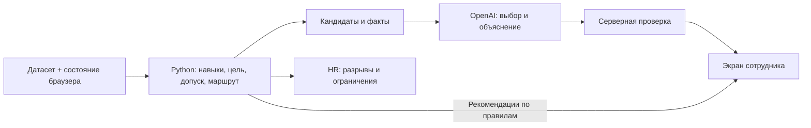

# Структура слайдов защиты

Ниже - заголовки, содержимое и визуальные материалы для презентации. Основной показ вести по [DEMO.md](DEMO.md); ответы на вопросы - в [QA.md](QA.md), решения и отклонения от спецификации - в [DECISIONS.md](DECISIONS.md). Числа получены из сохранённых запусков, команды указаны рядом в комментариях. Макеты экранов не выдавать за сделанные скриншоты: новые снимки выбранных профилей в этот пакет не входят.

## Слайд 1. Career Quest связывает следующий шаг обучения с карьерной целью сотрудника.

- HackAlem AI, трек Halyk Bank, кейс Career Quest.
- Сотруднику - понятное действие и объяснение его пользы.
- HR - разрывы навыков и причины отсутствия подходящих действий.

Визуал: название проекта и простая цепочка «Цель → объяснимый шаг → расчётный прогресс». Ссылку на [приложение](https://career-quest-bay.vercel.app) оставить видимой.

## Слайд 2. Разрозненные HR-события не объясняют, какое обучение поможет человеку сейчас.

- Низкий навык сам по себе не задаёт приоритет: важны цель, критичность, история и доступность.
- На исходном наборе у **33 из 200** сотрудников нет исполнимого полезного шага при текущих условиях.
- Отсутствие шага требует разбора каталога, а не ярлыка для сотрудника.

Визуал: крупно **33 / 200**, подпись «Синтетический набор; исходное состояние». Рядом - причины каталога: допуск, потолок навыка, уже завершённые активности. Не называть это долей «немотивированных» сотрудников.

<!-- Команда: PYTHONDONTWRITEBYTECODE=1 python3 docs/measure_demo.py . Источник: evidence/local_measurements.json hr_before.cards (employees=200, no_step=33); production подтверждение: PYTHONDONTWRITEBYTECODE=1 python3 docs/measure_production.py , evidence/production_measurements.json hr.response.cards. -->

## Слайд 3. Сотрудник видит, почему выбран шаг и что изменится после его выполнения.

- **E0143:** CRM **0/3**, но выбран курс по критическому Troubleshooting; прогноз и выполнение дают **70,2% → 76,6%**.
- **E0176:** Statistics **0 → 1** открывает A/B Testing; первый шаг оставляет готовность **44,7%**, вся цепочка даёт **50,0%**.
- **E0004:** цель Data Analyst → Product Manager взята из профиля; допуск к событиям сохраняется по текущей роли.

Визуал: перейти в живое демо. Для статичной версии снять E0143 с раскрытым «Почему этот шаг?» и прогноз маршрута E0176. Показать подпись «Готовность по навыкам», не заменять её на «шанс повышения».

<!-- Команды: PYTHONDONTWRITEBYTECODE=1 python3 docs/measure_demo.py ; PYTHONDONTWRITEBYTECODE=1 python3 docs/measure_production.py --output docs/evidence/production_demo_measurements.json --skip-import E0143 E0176 E0041 E0004 . Источники: local_measurements.json selected.multi_factor/bridge/cross_role, включая route_what_if; production_demo_measurements.json profiles[*].snapshot/simulate_main/completion. -->

## Слайд 4. Расчётное ядро определяет допустимые действия, а AI выбирает и объясняет их внутри этих границ.

- Python восстанавливает навыки, вычисляет разрывы, проверяет допуск и строит ограниченный маршрут.
- `gpt-6-luna` с `reasoning_effort=none` и контрактом V3 получает кандидатов и факты, выбирает шаги и формулирует объяснение.
- Сервер проверяет ответ; what-if, выполнение и HR используют то же расчётное ядро.

Визуал: схема потока, без логотипов неиспользуемых сервисов.

Источник архитектуры: [DECISIONS.md](DECISIONS.md), фактические `api/index.py`, `career_quest/` и `lib/store.ts`.

## Слайд 5. AI опирается на проверяемые факты, но проверка не гарантирует безошибочность свободного текста.

- Ограниченный список кандидатов, строгая схема ответа и серверная проверка приоритета и ссылок на факты.
- Неподтверждённые числа убирают текст объяснения; при отказе, обрезанном ответе, `null`, отсутствии ключа или таймауте остаются расчётные рекомендации с честным статусом.
- Имена и идентификаторы сотрудников не входят в контекст LLM; минимизация данных не равна анонимизации, смысловые ошибки ещё возможны.

Основание выбора: [отдельный эксперимент](evidence/model_selection.md), **16 конфигураций × 48 сценариев**, затем Luna V3 **48/48 live**; автоматических ошибок не найдено в **120/120** объяснениях, но ручное чтение **41** выявило **1 явную ошибку**. Эти результаты не смешивать со свежим production-замером.

Визуал: раскрытые факты E0143 и подпись статуса из реального экрана. Рядом небольшая рамка: «Проверен сервером ≠ доказана истинность каждого предложения». Не заявлять, что отправка облачному провайдеру автоматически соответствует банковским требованиям.

## Слайд 6. HR получает объяснение ограничения каталога и предмет для обсуждения изменений.

- **E0041:** шагов **0**, готовность **78,3%**; Communication и Stakeholder Management **4/5**, текущие активности не дают нужного прироста.
- **Leadership:** ниже требования **102** сотрудника, критический разрыв у **48**, активность в каталоге **1**.
- «Что можно изменить в каталоге» - черновик согласования доступа; бюджет и вместимость неизвестны.

Визуал: HR → «Нет шага» со строкой E0041 и раскрытый Leadership в «Навыки и ограничения». Существующий [общий скриншот HR](screenshots/hr.png) можно использовать как иллюстрацию интерфейса; конкретные числа брать из запуска, а для выбранной строки снять актуальный экран при репетиции.

<!-- Команды: PYTHONDONTWRITEBYTECODE=1 python3 docs/measure_demo.py ; PYTHONDONTWRITEBYTECODE=1 python3 docs/measure_production.py --output docs/evidence/production_demo_measurements.json --skip-import E0143 E0176 E0041 E0004 . Источники: local_measurements.json selected.no_step_catalog и hr_before.skills[skill_id=SK_LEADERSHIP]; production_demo_measurements.json profiles[employee_id=E0041], hr.response.skills. Leadership не меняется после основной демонстрационной отметки E0143: local_measurements.json hr_after_demo_completion. -->

## Слайд 7. Реальный запуск подтвердил согласованность расчётов и дал измеримую задержку AI на небольшой выборке.

- Локальный полный перебор: рекомендации есть у **167 из 200**; на **167 из 167** главных шагов what-if совпал с выполнением по навыкам и готовности.
- Production, **23 сентября 2026**: **6 из 6** новых ответов `gpt-6-luna` - `live_validated`; полный HTTP-запрос **3,195–7,554 с**. Ещё **2** ответа - кэш, **1** - `not_needed`.
- **169** локальных pytest-проверок и **11/11** браузерных тестов на production прошли. Сохранённая оценка ядра: **0 нарушений на 200 сотрудниках**. Эффект на обучение, нагрузка и скорость от клика до отрисовки не измерены.

Источники проверок: [pytest](evidence/pytest.txt), [Playwright](evidence/e2e-results.json), [отдельный отчёт ветки оценки](evidence/evaluation_branch.md). Оценка перенесена из уже выполненного запуска с совпавшими хешами ядра, её скрипт ещё не слит в текущий HEAD.

Визуал: две карточки с чёткими знаменателями: «Согласованность ядра» и «Свежие AI-вызовы». Мелкая подпись: «Синтетический датасет, последовательные запросы; кэш исключён из диапазона AI». Серверное время AI при вопросе жюри: **2,352–5,502 с**.

<!-- Источники: evidence/local_measurements.json и evidence/summary.json. Сводка строится docs/measure_summary.py из двух реальных production-серий; repeat_ai исключён, cached=true и not_needed не входят в новые вызовы. HTTP новых: min3195.490/max7554.186 мс; elapsed_ms: min2352/max5502. Команды - DEMO.md. -->

## Слайд 8. Следующий этап - защищённый пилот с проверкой качества рекомендаций и результата для сотрудников.

- Уже реализованы подписанные сессии, дедупликация отметок и ключ AI-кэша по содержимому данных. Дальше - корпоративный вход вместо общих паролей, глобальный отзыв сессий, серверное хранение и аудит.
- Проверка смысла объяснений и расширение проверок импорта; согласованный контур обработки данных и подтверждение выполнения через LMS. Ошибочные даты и оценки уже отклоняются.
- Совместная оценка рекомендаций с HR, затем пилот добровольного использования и проверка эффекта.

Визуал: последовательность «Доверенные данные и доступ → качество объяснений → пилот». Завершить приглашением загрузить проверочные профили через HR → «Данные». Не обещать измеренный рост завершаемости, обученную на HR-данных модель или прохождение ещё неизвестных профилей.

## Как рассказ покрывает критерии жюри

Работоспособность видна в живом цикле «рекомендация → прогноз → выполнение» и загрузке сценария. Техническое решение - в общей расчётной логике и ограниченном AI-слое. Воспроизводимость обеспечивают README проекта, команды в этих материалах и исходные JSON запусков. Применимость показывают оба пользовательских сценария; отличительная идея - подготовительная цепочка с проверяемым открытием следующего шага. Сравнение оригинальности с другими командами не проводилось.
